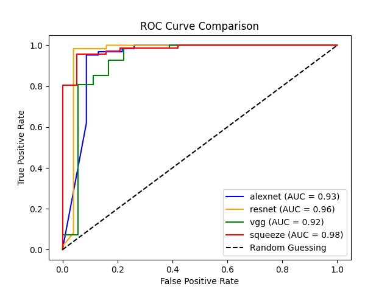

### Introduction
This project seeks to integrate machine learning and artificial intelligence into microscopic techniques to study biological cells which will widen the scope of existing microscopy. Machine Learning algorithms can automate tasks and thus can improve efficiency, accuracy and consistency. They can offer better image processing and pattern recognition techniques thus, enhancing the observations and results. This will offer improved data integration and real-time analysis.

The project was utilises the principles of diffraction and angular spectrum propagation. We used helper functions to create local binary pattern maps for all the images in the set. These maps were used as the input for data processing unit. The dataset was then arranged as images and labels after which it was shuffled and converted to Pandas dataframe. After splitting and normalization, the dataset obtained was a set of randomly arranged images in the form of matrices along with labels with specify whether they tested positive or negative for sickle cell disease.

### Description of Dataset
The dataset used in this project comprises of microscopic images of blood sample for sickle cell disease detection structured into 422 positive samples (indicating the presence of sickle cell disease) and 147 negative samples (indicating healthy cell cases). This dataset is stored in a Pandas DataFrame format for efficient analysis and manipulation. Each image was preprocessed to create a distinct opto-biological signature, further enhanced by applying a local binary pattern map for feature extraction. These features form the basis for training and evaluating machine learning models like AlexNet, Resnet-50, VGG-19 and SqueezeNet, with the aim of accurately classifying samples based on the presence or absence of sickle cell disease.

The dataset hase been borrowed from [Florence Tushabe, Samuel Mwesige, Kasule Vicent, Emmanuel Othieno, Emily Nsiimire, Philip Mutabazi, Sarah Musani, and David Areu, “A Dataset of Microscopic Images of Sickle Cells,” 5th Global Webinar on AI ML, Data Science and Robotics (2024)](https://www.kaggle.com/datasets/florencetushabe/sickle-cell-disease-dataset)

The research article used for reference is [Peter M. Douglass, Timothy O'Connor, Bahram Javidi, “Automated sickle cell disease identification in human red blood cells using a lensless single random phase encoding biosensor and convolutional neural networks,” Optics Express, **30**(20), 35965-35977 (2022)](https://opg.optica.org/oe/fulltext.cfm?uri=oe-30-20-35965&id=502835)

### Description of Files in the Project
1. **lbp.py**: Generates local binary pattern map of the opto-biological signatures of the images in the dataset, uses angular spectrum method of propagation to model the SRPE system
2. **load_images.py**: Loads images into the project and converts the dataset to a Pandas DataFrame
3. **alexnet.py**, resnet50.py, vgg19.py, squeezenet.py: Contain loading and implementation of pre-trained models along with calculation of evaluation metrics, also generate respective pickle files to be used in ROC curve construction
4. **auc_score**: Loads the pickle files of all four models into a single file and plots the ROC curve to find AUC score

### Observations
| Model | Accuracy | Precision | Recall | F1 Score |
|-------|----------|-----------|--------|----------|
| AlexNet | 89.53% | 0.9219 | 0.9365 | 0.9291 |
| ResNet-50 | 90.70% | 0.9836 | 0.8955 | 0.9375 |
| VGG-19 | 96.51% | 0.9552 | 1.000 | 0.9771 |
| SqueezeNet | 91.86% | 0.9104 | 0.9839 | 0.9457|

VGG-19 and SqueezeNet emerged as top models, with VGG-19 excelling in recall and accuracy, while SqueezeNet showed balanced performance with the highest AUC score, suggesting it might generalize well for this classification task.
